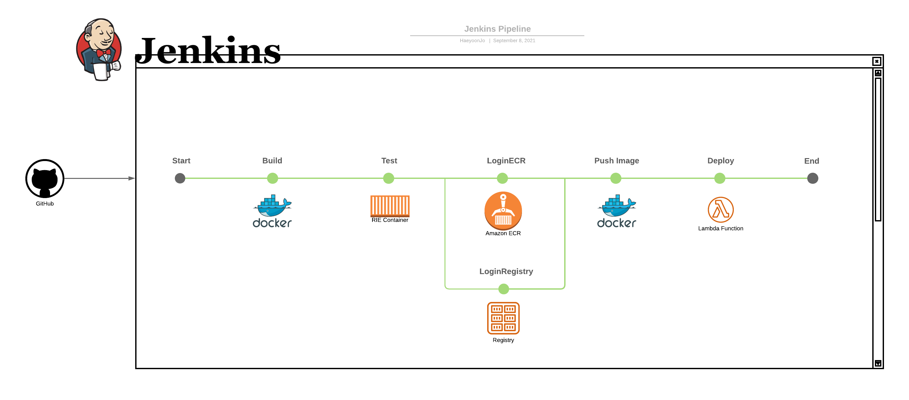

# Jenkins pipeline를 이용한 AWS Lambda function 배포

Jenkins pipeline에서 Declarative & Scripted 문법을 지원한다.  
Scripted 문법은 유연하게 프로그래밍적으로 접근이 가능하도록 하며, Declarative 문법은 최근에 지원을 시작한 방식으로 시각적으로 간결하면서 쉬운 유지보수를 할 수 있도록 한다.

이 프로젝트에서는 Declarative 문법을 사용하여 AWS Lambda function에서 실행되는 간단한 파이썬 어플리케이션을 배포하는 파이프라인을 작성하였다.

해당 레파리토리는 Jenkinsfile을 이용한 파이프라인 작성을 주 목적으로 하였기때문에, Jenkins 또는 Jenkinsfile 문법과 관련하여 발생가능한 이슈 또는 적용해볼만한 advanced features 등을 기록 및 작업관리를 깃허브 이슈페이지를 활용하여 관리하였다.  
이슈 페이지: https://github.com/HaeyoonJo/devops-handson-jenkins-pipeline-py/issues


## 프로젝트 설명

도커라이징된 파이썬 어플리케이션을 AWS Lambda function에서 실행시키고, 로컬 테스트 및 배포는 브랜치 전략과 함께 젠킨스파일에 구성된 Jenkins pipeline을 통해 CICD pipeline을 구현하였다.  
아래 이미지에서는 사용된 리소스와 파이프라인 단계를 살펴보면서, 각 단계에서 어떤 작업이 이루어지는지 추정을 할 수 있다.  



<!-- Another way to add image source>
<!-- 

<style type="text/css">
    img {
        width: 1000px;
    }
</style> -->

### 각 pipeline 단계별 설명

1. Build

- [Docker pipeline](https://plugins.jenkins.io/docker-workflow/)의 `docker.build()` 메소드를 사용하여 도커이미지를 빌드한다.

2. RIE Test

- 어플리케이션을 Dockerfile를 통해 도커라이징한 후, AWS에서 제공하는 `public.ecr.aws/lambda/python` 도커 이미지를 사용하여 [RIE( Runtime Interface Emulator )](https://docs.aws.amazon.com/lambda/latest/dg/images-test.html) Lambda 컨테이너 이미지를 테스트한다.

3. Login ECR

- aws-pipeline의 `withAWS()` 메소드를 사용하여, `sh` 블록안에서 AWS ECR 레파지토리로 로그인하는 aws-cli를 실행한다. 해당 명령문은 ECR 콘솔에서 "푸쉬 명령 보기" 팝업창에서 복사했으며, 다음과 같은 구조로 명령을 실행할 수 있다.
```
aws ecr get-login-password \
    --region "YOUR_REGION" \
    | docker login \
    --username AWS \
    --password-stdin "YOUR ECR REPO URI"
```
